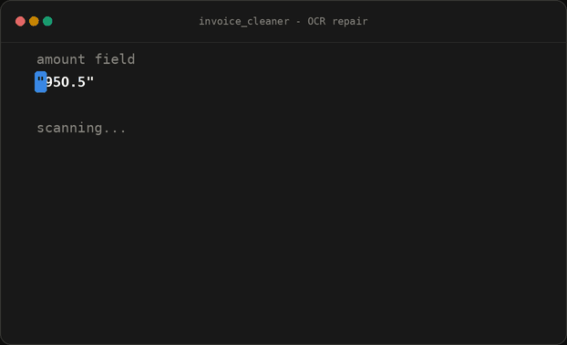
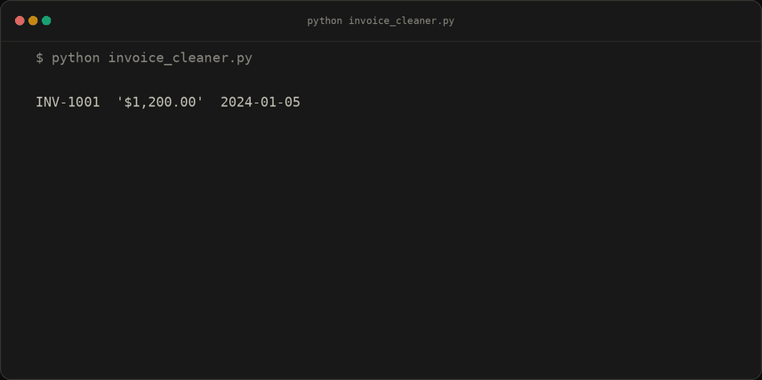
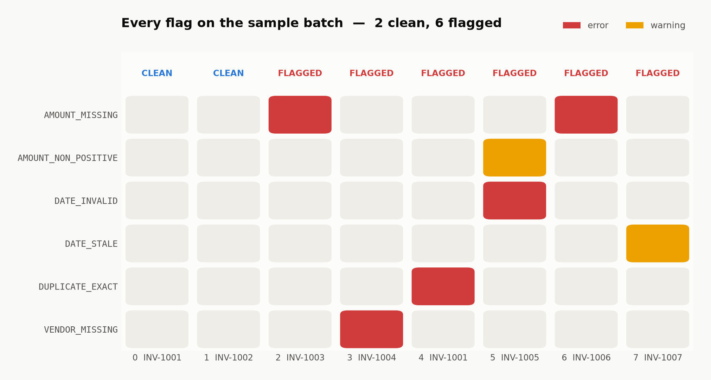
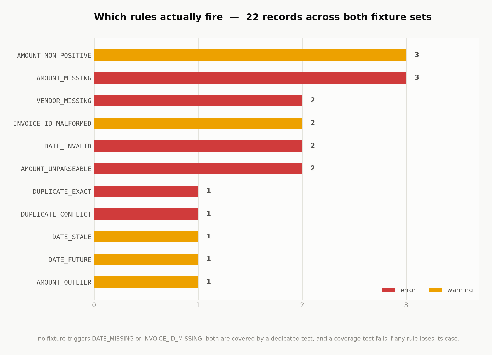
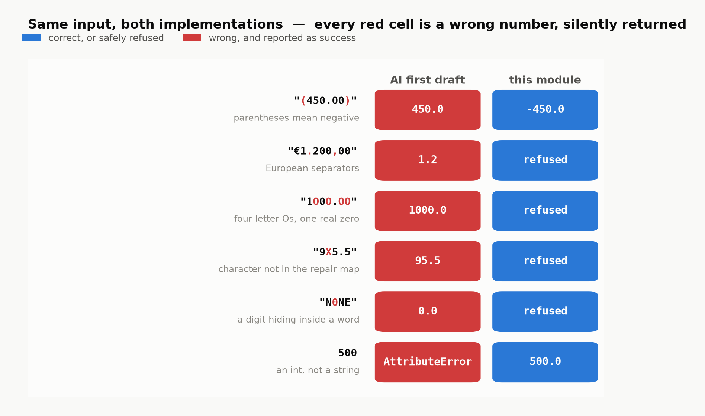
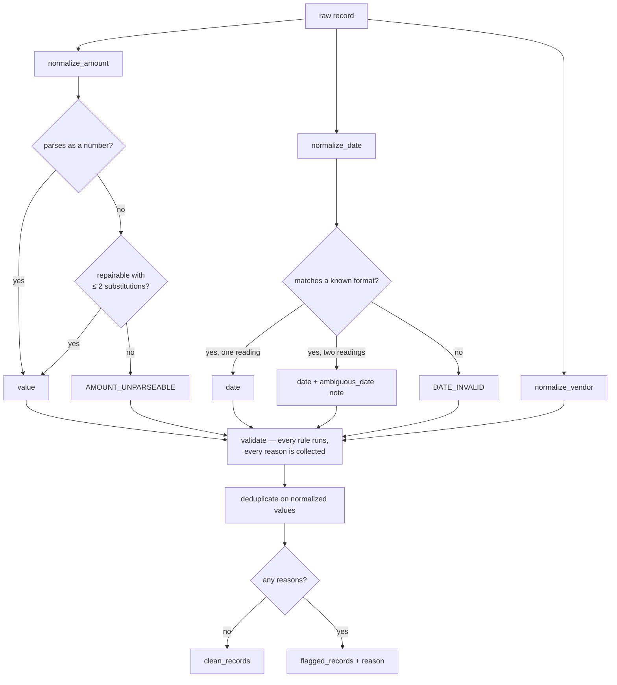

# Invoice OCR Cleaner

Takes the messy output of an invoice OCR extraction step and turns it into clean, validated
data — without ever silently inventing a number.

[](https://github.com/eyalsht/OCR-Genpact-/actions/workflows/ci.yml)


```python
from invoice_cleaner import process_records

clean_records, flagged_records = process_records(raw_records)
```

---

## The conversations behind this

Three AI conversations produced this repository, and all three are readable in full:

| # | Chat | What happened in it |
|---|---|---|
| 1 | **[Planning](https://claude.ai/share/9925bbb9-a404-4a08-b618-e92a6a23dea5)** ↗ | Before any code. Where the central rule came from: OCR repair belongs to the *field*, not the string — so it may touch an amount and must never touch an identifier. |
| 2 | **[Build session](docs/ai-chat-log/02-build-session.md)** | The TDD cycles, and the two bugs that only surfaced by running things: a chart that rendered completely empty, and a README install command that failed on a fresh clone. |
| 3 | **[Cold first draft](docs/ai-chat-log/03-first-draft-session.md)** | A fresh context given *only* the assignment text and told to write [`naive_first_draft.py`](naive_first_draft.py) in one pass, without running or revising it. Committed unedited, before I wrote anything of my own. |

Chats 2 and 3 are exported from Claude Code's own session files by
[`tools/export_chat.py`](tools/export_chat.py) — images dropped, long tool output truncated,
harness scaffolding stripped, nothing else edited. The model's reasoning is kept and folded
into `<details>`, including the passages where it was wrong.

[**`THOUGHTS.md`**](THOUGHTS.md) is the half-page write-up the brief asks for;
[**`docs/ai-log.md`**](docs/ai-log.md) is the longer account of what I asked for, what came
back, and where I disagreed with it.

---

## The one decision this module is built around

OCR reads a letter `O` where a digit `0` should be. Repairing that inside an **amount** is
obviously right. Repairing it inside an **invoice ID** would merge two different invoices into
one and quietly delete a payable.

So the substitution map is reachable from exactly one place: the amount parser.



That is the whole design in one animation. The repair is a *fallback* — the string is parsed
first and the map is only tried on failure — it is capped at two substitutions, it records
what it changed, and it never touches an identifier or a vendor name.

Substitution direction is a property of the field, not of the string. In a numeric field the
letter is the misread; in a text field the digit is. A single global map applied everywhere is
wrong by construction. ([sources](docs/RESEARCH.md))

---

## Running it on the sample



<!-- results:start -->
| # | `invoice_id` | raw `amount` | raw `date` | verdict | what happened |
|---|---|---|---|---|---|
| 0 | `INV-1001` | `'$1,200.00'` | `2024-01-05` | **clean** | `1200.00` · `2024-01-05` |
| 1 | `INV-1002` | `'95O.5'` | `01/06/2024` | **clean** | `950.50` · `2024-01-06`  — _ocr_substitution_, _ambiguous_date_ |
| 2 | `INV-1003` | `'N/A'` | `2024-01-07` | flagged | `AMOUNT_MISSING` — no amount was extracted ('N/A') |
| 3 | `INV-1004` | `'2,340'` | `Jan 8, 2024` | flagged | `VENDOR_MISSING` — vendor name is blank or absent ('') |
| 4 | `INV-1001` | `'$1,200.00'` | `2024-01-05` | flagged | `DUPLICATE_EXACT` — an identical record for this invoice already appeared in the batch (first seen at index 0) |
| 5 | `INV-1005` | `'-450.00'` | `2024-13-40` | flagged | `AMOUNT_NON_POSITIVE` — amount is zero or negative, which may be a credit note (-450.00)<br>`DATE_INVALID` — date does not match any supported format, or is not a real calendar date ('2024-13-40') |
| 6 | `INV-1006` | `'  '` | `2024/01/09` | flagged | `AMOUNT_MISSING` — no amount was extracted ('  ') |
| 7 | `INV-1007` | `'3200.00'` | `2019-01-10` | flagged | `DATE_STALE` — date is far older than the rest of the batch (1825 days before 2024-01-09) |

**8 records in — 2 clean, 6 flagged.** Nothing is dropped: every input row appears in exactly one of the two lists.

<!-- results:end -->

> This table is generated by `python render_results.py`, and CI runs
> `render_results.py --check`, which fails the build if the README and the code disagree. Every
> image below is drawn by `tools/make_assets.py` from the same live run. No number in this
> README was typed in by hand.

A 25% pass rate is a legitimate result for OCR output. It was tempting to loosen the rules to
make the demo look better; the rules are right and the data is bad.

<picture>
  <source media="(prefers-color-scheme: dark)" srcset="docs/assets/rule-matrix-dark.png">
  
</picture>

Row 5 is the one worth looking at: it has a negative amount **and** an impossible date. Every
validator runs and appends to a list, so both come back. Stopping at the first problem would
send someone round the loop twice.

---

## Why each record is flagged, in one sentence

| Rule | Severity | Means |
|---|---|---|
| `AMOUNT_MISSING` | error | No amount was extracted. `"N/A"` and `"  "` are absences, not zeros. |
| `AMOUNT_UNPARSEABLE` | error | Something was extracted but no trustworthy number could be read from it. |
| `AMOUNT_NON_POSITIVE` | warning | Zero or negative. Might be a credit note, so a human decides. |
| `AMOUNT_OUTLIER` | warning | Implausibly large — a misplaced decimal point always fails upward. |
| `DATE_MISSING` | error | No date was extracted. |
| `DATE_INVALID` | error | No supported format matches, or it is not a real calendar date. |
| `DATE_FUTURE` | warning | Dated after the batch it arrived in. |
| `DATE_STALE` | warning | Far older than everything around it. |
| `VENDOR_MISSING` | error | Blank or absent vendor name. |
| `INVOICE_ID_MISSING` | error | No identifier at all. |
| `INVOICE_ID_MALFORMED` | warning | Does not match `INV-<digits>` — which is how `INV-1OO1` gets noticed. |
| `DUPLICATE_EXACT` | error | This invoice already appeared, identically. |
| `DUPLICATE_CONFLICT` | error | This invoice already appeared **with different content**. One of the two is wrong. |

`DUPLICATE_EXACT` and `DUPLICATE_CONFLICT` are kept apart deliberately. A re-scan of the same
invoice is housekeeping. The same ID carrying a different amount means one of two numbers is
wrong and nothing in the data says which — filing those together loses the only signal that
says so.

<picture>
  <source media="(prefers-color-scheme: dark)" srcset="docs/assets/flag-counts-dark.png">
  
</picture>

The provided sample never triggers four of the rules, so there is a second fixture set that
does. A rule with no test is a rule nobody has verified, and a test asserts that every rule in
the table above has a case that fires it.

---

## What the AI's first draft got wrong

Before writing any of this, I asked an AI for an implementation from a cold start, given only
the assignment text. That reply is committed unedited as
[`naive_first_draft.py`](naive_first_draft.py).

It was better than expected. It handled the whitespace-only amount, repaired the `95O.5`
misread, parsed all five date formats, and collected more than one reason per record — the bug
I most expected to find was not there.

What it got wrong is narrower and much worse:

<picture>
  <source media="(prefers-color-scheme: dark)" srcset="docs/assets/draft-comparison-dark.png">
  
</picture>

Every red cell is a confidently wrong number returned with no flag raised. `(450.00)` is an
accounting negative and comes back as **+450**, turning a credit note into a payable.
`€1.200,00` comes back as **1.2**, off by a factor of a thousand. `1O0O.OO` needs four
substitutions and gets them, silently. In a finance pipeline a wrong number nobody was told to
check is far worse than a missing one.

There is also a structural bug: the draft only remembers identifiers from records that came
out *clean*, so a duplicate of an already-flagged invoice is not recognised and gets emitted as
new.

All of it is pinned in [`tests/test_naive_regression.py`](tests/test_naive_regression.py),
which runs both implementations over the same inputs — including two tests recording what the
draft got right, so the comparison is not a straw man.

---

## How it works



Four decisions worth calling out; the rest are in [THOUGHTS.md](THOUGHTS.md).

**The signature is unchanged.** The brief asked for
`process_records(raw_records) -> tuple[list[dict], list[dict]]` and that is exactly what it is.
The one addition is a keyword-only `reference_date=None`, which is a strict superset of the
required contract.

**"Stale" is measured against the batch, not the clock.** The obvious implementation is
`date.today() - parsed > 730 days`, which means this demo destroys itself as the calendar
moves — run it in 2027 and all eight rows are stale. Instead the reference date is the latest
date in the batch (2024-01-09 here), so the answer is stable forever. The weakness, stated
plainly: if an entire batch is ancient, nothing inside it looks stale.

**`01/06/2024` is genuinely ambiguous, so it is recorded as such.** Jan 6 and Jun 1 are both
real dates and no parser can choose from the string alone. The batch can: INV-1001 is Jan 5,
INV-1003 is Jan 7, INV-1004 is Jan 8, and the IDs run in sequence — so the INV-1002 sitting
between them is Jan 6. That is an inference from the data rather than a coin flip, but it is
still an inference, so the clean record carries an `ambiguous_date` note naming the other
reading. A note, not a flag: the value is usable, only its provenance is uncertain.

**Duplicates are flagged, not dropped.** Dropping data without a trace is the wrong default
anywhere and specifically wrong here, where the missing row is a payable nobody will chase.
The first occurrence stays clean; later ones move to `flagged` with the index of the record
they duplicate. Dedupe runs *after* normalization, so `"$1,200.00"` and `"1200"` collide the
way they should.

---

## Quickstart

```bash
git clone https://github.com/eyalsht/OCR-Genpact-.git
cd OCR-Genpact-
pip install -e ".[dev]"

python -m pytest -q          # 109 tests
ruff check .
python invoice_cleaner.py    # every verdict, with the rule that produced it
python render_results.py     # regenerate the table above from a live run
```

The module itself has **zero runtime dependencies** — standard library only, so
`git clone && pytest` works offline. `pytest` and `ruff` are dev-only; `pillow` and
`matplotlib` live in a separate `[assets]` extra used only to regenerate the images, which are
committed.

```
invoice_cleaner.py       the module
sample_data.py           the 8 given rows, verbatim, plus 14 of my own
naive_first_draft.py     the unedited AI first attempt
render_results.py        regenerates the results table above
tests/                   109 tests across 5 files
tools/make_assets.py     regenerates every image in this README
docs/RESEARCH.md         sourced background on OCR confusion pairs
docs/ai-log.md           how AI was used, and where I disagreed with it
docs/ai-chat-log/        the full conversation transcripts
```

---

## Known gaps

- **European separators are refused, not parsed.** `1.200,00` is twelve hundred, but `1.200`
  alone is equally readable as 1.2. Detecting the convention reliably needs a locale hint, and
  guessing on money is worse than declining, so it lands in `AMOUNT_UNPARSEABLE`.
- **Vendors are compared as exact normalized strings.** `Acme Corp`, `ACME Corp.` and
  `Acme Corporation` are one vendor and this module treats them as three. Fuzzy matching needs
  a tuned threshold and an untuned one merges records that should not be merged.
- **The confusion map is unweighted.** A frequency-weighted matrix derived from the actual OCR
  engine's output distribution would beat it, given access to that engine.
- **The staleness threshold is 730 days**, which is a defensible number rather than a derived
  one. It is one named constant.

## No LLM in the runtime path

An agent pipeline is a natural fit for OCR correction in general and a bad fit for this
module. Two runs over the same invoices must produce the same flags; `git clone && pytest` has
to work with no API key; and every flag needs to trace to one named constant and one function,
because "the model decided" is not a reason a finance team can act on.

See [docs/ai-log.md](docs/ai-log.md) for where AI was genuinely useful — which was research,
a first draft to argue with, and the tooling around the module rather than the module itself.
